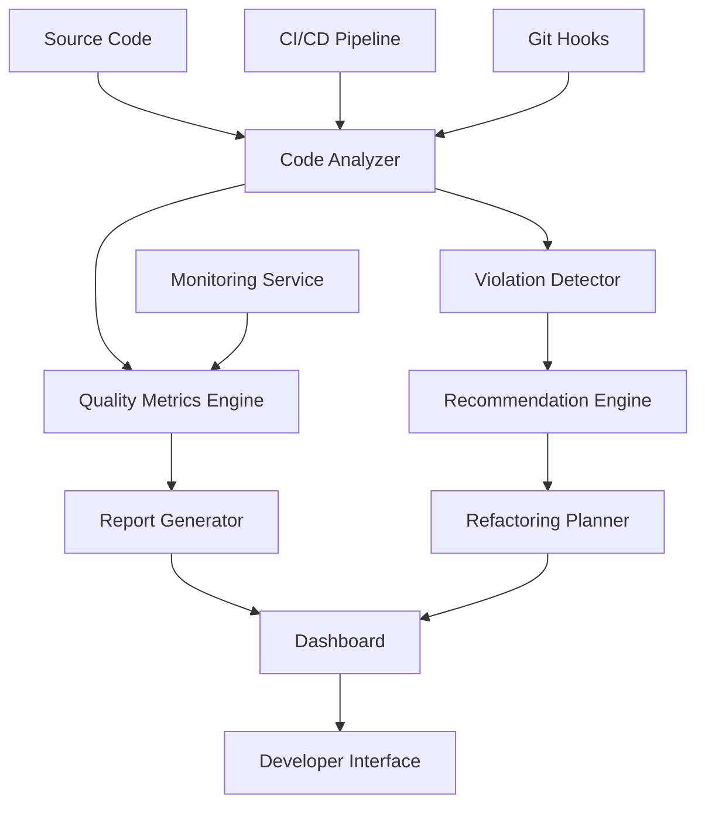

# Clean Code Review System Design

## Overview

The Clean Code Review System is a comprehensive solution for analyzing, improving, and maintaining code quality across the Kin Workspace codebase. It combines automated analysis tools, manual review processes, and continuous monitoring to systematically apply Clean Code principles.

## Architecture

### High-Level Architecture



### Component Architecture

The system consists of six main components:

1. **Code Analysis Engine** - Parses and analyzes source code
2. **Quality Assessment Service** - Evaluates Clean Code principles
3. **Recommendation Generator** - Creates actionable improvement suggestions
4. **Progress Tracking System** - Monitors improvements over time
5. **Reporting Dashboard** - Visualizes metrics and progress
6. **Integration Layer** - Connects with development tools

## Components and Interfaces

### 1. Code Analysis Engine

**Purpose**: Parse TypeScript/JavaScript files and extract structural information

**Key Classes**:
```typescript
interface CodeAnalyzer {
  analyzeFile(filePath: string): Promise<FileAnalysis>
  analyzeBatch(filePaths: string[]): Promise<BatchAnalysis>
  getMetrics(analysis: FileAnalysis): QualityMetrics
}

interface FileAnalysis {
  filePath: string
  functions: FunctionInfo[]
  classes: ClassInfo[]
  imports: ImportInfo[]
  complexity: ComplexityMetrics
  lineCount: number
  testCoverage?: CoverageInfo
}
```

**Responsibilities**:
- Parse AST (Abstract Syntax Tree) from source files
- Extract function signatures, class definitions, and dependencies
- Calculate cyclomatic complexity
- Identify code patterns and structures

### 2. Quality Assessment Service

**Purpose**: Evaluate code against Clean Code principles

**Key Classes**:
```typescript
interface QualityAssessor {
  assessFile(analysis: FileAnalysis): QualityReport
  assessPrinciple(principle: CleanCodePrinciple, analysis: FileAnalysis): PrincipleScore
  generateOverallScore(reports: QualityReport[]): OverallQuality
}

interface QualityReport {
  filePath: string
  overallScore: number
  principleScores: Map<CleanCodePrinciple, PrincipleScore>
  violations: Violation[]
  strengths: string[]
}
```

**Assessment Criteria**:
- **Naming**: Descriptiveness, consistency, searchability
- **Functions**: Size, single responsibility, parameter count
- **Classes**: Cohesion, coupling, single responsibility
- **Comments**: Necessity, accuracy, value-add
- **Error Handling**: Consistency, robustness
- **Testing**: Coverage, quality, maintainability

### 3. Recommendation Generator

**Purpose**: Create specific, actionable improvement suggestions

**Key Classes**:
```typescript
interface RecommendationEngine {
  generateRecommendations(violations: Violation[]): Recommendation[]
  prioritizeRecommendations(recommendations: Recommendation[]): PrioritizedPlan
  estimateEffort(recommendation: Recommendation): EffortEstimate
}

interface Recommendation {
  id: string
  type: RefactoringType
  description: string
  beforeCode: string
  afterCode: string
  principle: CleanCodePrinciple
  effort: EffortLevel
  impact: ImpactLevel
  dependencies: string[]
}
```

**Recommendation Types**:
- Extract Method
- Rename Variable/Function/Class
- Reduce Parameter Count
- Split Large Class
- Remove Dead Code
- Improve Error Handling
- Add Missing Tests

### 4. Progress Tracking System

**Purpose**: Monitor improvements and track trends over time

**Key Classes**:
```typescript
interface ProgressTracker {
  recordBaseline(analysis: BatchAnalysis): Baseline
  trackImprovement(before: QualityReport, after: QualityReport): Improvement
  generateTrendReport(timeRange: DateRange): TrendReport
  calculateROI(improvements: Improvement[]): ROIMetrics
}

interface TrendReport {
  timeRange: DateRange
  qualityTrend: QualityTrend
  violationTrends: Map<CleanCodePrinciple, Trend>
  completedRecommendations: number
  estimatedTimeInvested: number
  measuredBenefits: Benefit[]
}
```

### 5. Reporting Dashboard

**Purpose**: Visualize code quality metrics and progress

**Components**:
- **Overview Dashboard**: High-level quality metrics and trends
- **File Explorer**: Drill-down view of individual files and functions
- **Recommendation Queue**: Prioritized list of improvements
- **Progress Tracker**: Visual representation of improvements over time
- **Team Performance**: Comparative metrics across team members

**Key Features**:
- Interactive charts and graphs
- Filterable and sortable data views
- Export capabilities for reports
- Integration with project management tools

### 6. Integration Layer

**Purpose**: Connect with existing development tools and workflows

**Integrations**:
- **Git Hooks**: Pre-commit quality checks
- **CI/CD Pipeline**: Automated quality gates
- **IDE Extensions**: Real-time feedback during development
- **Code Review Tools**: Quality insights in pull requests
- **Project Management**: Link improvements to user stories/tasks

## Data Models

### Core Data Structures

```typescript
// Quality Metrics
interface QualityMetrics {
  complexity: ComplexityMetrics
  maintainability: MaintainabilityScore
  testability: TestabilityScore
  readability: ReadabilityScore
}

// Violations and Issues
interface Violation {
  id: string
  principle: CleanCodePrinciple
  severity: Severity
  location: CodeLocation
  description: string
  suggestion: string
}

// Improvement Tracking
interface Improvement {
  recommendationId: string
  implementedDate: Date
  beforeMetrics: QualityMetrics
  afterMetrics: QualityMetrics
  timeInvested: number
  developer: string
}
```

## Error Handling

### Error Categories
1. **Analysis Errors**: File parsing failures, syntax errors
2. **Configuration Errors**: Invalid settings, missing dependencies
3. **Integration Errors**: CI/CD failures, tool connectivity issues
4. **Data Errors**: Corrupted metrics, missing historical data

### Error Handling Strategy
- Graceful degradation for non-critical failures
- Detailed logging for debugging and monitoring
- User-friendly error messages with actionable guidance
- Automatic retry mechanisms for transient failures
- Fallback modes when external integrations fail

## Testing Strategy

### Unit Testing
- Test each component in isolation
- Mock external dependencies
- Achieve >95% code coverage
- Focus on edge cases and error conditions

### Integration Testing
- Test component interactions
- Validate data flow between services
- Test external tool integrations
- Verify end-to-end workflows

### Performance Testing
- Load testing with large codebases
- Memory usage optimization
- Response time benchmarks
- Scalability validation

### User Acceptance Testing
- Developer workflow validation
- Dashboard usability testing
- Report accuracy verification
- Integration effectiveness assessment

## Implementation Phases

### Phase 1: Foundation (Weeks 1-4)
- Set up core analysis engine
- Implement basic quality metrics
- Create simple violation detection
- Build minimal reporting interface

### Phase 2: Enhancement (Weeks 5-8)
- Add recommendation generation
- Implement progress tracking
- Create comprehensive dashboard
- Integrate with Git hooks

### Phase 3: Integration (Weeks 9-12)
- CI/CD pipeline integration
- IDE extension development
- Advanced analytics and trends
- Team collaboration features

### Phase 4: Optimization (Weeks 13-16)
- Performance optimization
- Advanced recommendation algorithms
- Machine learning for pattern detection
- Comprehensive documentation and training

## Security Considerations

- Secure handling of source code data
- Access control for sensitive metrics
- Audit logging for all changes
- Data encryption for stored metrics
- Compliance with data protection regulations

## Scalability and Performance

- Incremental analysis for large codebases
- Caching of analysis results
- Parallel processing for batch operations
- Database optimization for historical data
- CDN integration for dashboard assets

## Monitoring and Observability

- System health monitoring
- Performance metrics tracking
- Error rate monitoring
- User engagement analytics
- Quality improvement ROI tracking